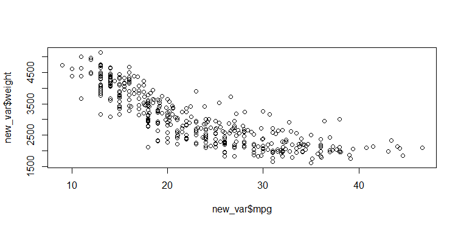

# Task 1: VCF-file-handeling-and-processing
  
  Current exome/sequencing variant calls are standardly output in variant call format (VCF) format. We provided you with a small VCF file (Test_annotate.vcf) and ask you to check out the features of this file and process it further.

  #### Task 1a: Use the provided Test_annotate.vcf to select only the SNPs using the Genomic Analysis Toolkit aka GATK (thus removing the INDELS). Provide us with the code you used to do this.
  
    There were 5746 SNPs out of 6000 in the vcf.
    This is the code I used:
    
    ./gatk SelectVariants -select-type SNP -V Test_annotate.vcf -O snp_only.vcf
    # I confirmed the output with bcftools 
           bcftools view --types snps Test_annotate.vcf > test.vcf

  #### Task 1b: Annotate the SNP VCF file you just created using the Refseq and cytoBand databases with the latest standalone version of ANNOVAR. Use a 12bp splice boundary as an argument instead of the default splice boundary definitions.
  ###### Downloading and unzipping annovar
      wget http://www.openbioinformatics.org/annovar/download/0wgxR2rIVP/annovar.latest.tar.gz
      tar xvzf annovar.latest.tar.gz
      
  ###### Downloading RefSeq and cytoBand databases for annotation
      annotate_variation.pl -buildver hg19 -downdb -webfrom annovar refGene humandb/
      annotate_variation.pl -buildver hg19 -downdb cytoBand humandb/
      
  ###### Annotating the VCF file:    
       perl  table_annovar.pl  snp_only.vcf   humandb/ -buildver hg19   -out snp_anno -remove  -protocol refGene  -nastring . -arg '-splicing 12'   -vcfinpu --operation g
       
       
       perl  table_annovar.pl  snp_only.vcf   humandb/ -buildver hg19   -out snp_anno -remove  -protocol refGene,cytoBand   -nastring . -vcfinpu --operation g,g
       
       
       
       
      How many unique variants are in this file?
          5323 variants are unique out of 5747 SNPs
     
      How many “splicing” variants do you see in the refseq annotation?
         I found 221 splicing variant which included: 
            194 splicing 
            2 ncRNA_splicing 
            1 ncRNA_exonic;splicing 
            24 exonic;splicing
            
      How many “startloss” variants do you see?
          I found 4 "startloss" variant


  #### Task 1c: Write a short methods section (similar as for a peer-reviewed paper) to describe what you did in task 1a and 1b
  
      To analyze and handle the VCF file, we first of all fetched all the SNPs (deleted indels) using the tool "GATK" which is a standard tool for identifying SNPs and indels. I cross checked the output of GATK with another tool called "bcftools" which is a set of utilities that manipulate variant calls in the Variant Call Format. The SNPs were then annotated with the tool Annovar (ANNOtate VARiation) for the further interpretation of single nucleotide variants. The output of the tool "ANNOVAR" had informations about the splice sites, startloss, startgain, synonyms non-synonyms mutations. A total of 221 splicing cites were annotated which included 194 splicing, 2 ncRNA_splicing, 1 ncRNA_exonic;splicing and 24 exonic;splicing. 
We also found 4 "startloss" variant.

      To find the number unique variants, a subset of the VCF file was made which had 4 columns as: "#CHROM"	"POS"	"REF"	"ALT". The BASH command, "uniq -c" and "sed" was used to count repeated SNPs. Here is the exact command wich as used:
      sed <<'s/\t/_/g' totest.Unique.variants.vcf | sort | uniq -c >>      
The first column of the output of the above command, had frequency of each SNP, which was counted.  A total of 5323 variants were unique out of 5747 SNPs.

    

# Task 3- R exercise: phenotype data proprocessing
  ## Dataset 
  
    The data-set can be found as "VCF-file-handeling-and-processing/data_cleaned.csv"
  ## Genetic association study
  
    We perform genetic association studies to identify genetic factors (variants) that may be involved in a complex trait (tinnitus, asthma, etc) etiology.
    In brief, genetic association studies compare and identify difference in genetic data of individuals with disease (cases) to those without (controls). 
    We report genetic variants that are observed more frequently in cases than in controls.
    
    In order to perform genetic association studies, we need phenotype data and genotype data from individuals we collect.
    
    - Phenotype and covariate data: age, sex, height, weight, condition for that trait (tinnitus in the example below case), etc.
    - Genotype data: You can roughly understand it as a sequence of the bases in DNA molecules, A/T/C/G, for all chromosomes in human genome.
    
   ### Setting up the environment for the analysis
   
      rm(list=ls())
      library(magrittr) # needs to be run if we want to use %>%
      library(dplyr)    # alternatively, this also loads %>%
      
      # setting working directory
      setwd("/Users/swadh/Desktop/columbia/")
      
      # Loading the dataset
      sub_UKBB<-read.csv("data_cleaned.csv")    
     
      
   ### **Q1:** How many females and males are there in this data? Please show your code below how these numbers are computed.
   
        count(sub_UKBB$f.22001.0.0)
   ##### OUTPUT
   
        #Female: 77535
        #Male: 67221
    
   ### **Q2:** What type of trait do you think best describes tinnitus as a phenotype?  A.Binary B. Continuous C. Ordinal 
   
        It sould be Ordinal

   ### **Q3:** Recode f.4803
   
   Field 4803 (f.4803) is the answers from participants for ACE touchscreen question "Do you get or have you had noises (such as ringing or buzzing) in your head or in one or both ears that lasts for more than five minutes at a time?" These fields contains answers to the questions in their first, 2nd, 3rd and 4th hospital visit: f.4803.0.0, f.4803.1.0, f.4803.2.0, f.4803.3.0. 
   
         ```{r recode}
      # Recode function:
      recode<-function(df,column_name){
        new_names<-c()
        for (i in column_name){
          new_column_name<-paste0(i,"_recode")
          new_names<-c(new_names,new_column_name)
          df[,new_column_name] <- revalue(df[,i], c("No, never"= 0, 
                                                  "Yes, but not now, but have in the past"= 1, 
                                                  "Yes, now some of the time"= 1, 
                                                  "Yes, now a lot of the time"= 1,
                                                  "Yes, now most or all of the time"= 1,
                                                  "Prefer not to answer"= NA,
                                                  "Do not know"= NA ))
        }
        return (list(df=df,new_column_names=new_names))
      }

      # columns needs to be recoded:
      column_name<-c("f.4803.0.0","f.4803.1.0","f.4803.2.0","f.4803.3.0")

      # get a new data.frame with recoded columns added:
      df_recode<-recode(df=sub_UKBB,column_name)$df

      # get names of recoded columns:
      new_column_names<-recode(df=sub_UKBB,column_name)$new_column_names

      # show recode summary:
      for (i in new_column_names)
      {cat(i,"summary:");print(table(df_recode[,i]));cat("\n")}
      ```

   #### What do you think has been achieved by recoding these fields?
        First: We are counting the number of "No" and "Yes" for each of the 4 hostpital visits of the patients. The "yes" and "No" are the answer of the patients to the question "Do you get or have you had noises (such as ringing or buzzing) in your head or in one or both ears that lasts for more than five minutes at a time?". 
        
        The binary output is generated in the end in which:
        "0" stands for "No" (total number of "No" is written bellow this number.)
        "1" stands for "Yes" (total number if "Yes" is writen bellow this number)
        
   ###### OUTPUT:
        
            f.4803.0.0_recode summary:
                0     1 
            80805 31685 

            f.4803.1.0_recode summary:
                0     1 
            10282  4214 

            f.4803.2.0_recode summary:
                0     1 
            22583 11405 

            f.4803.3.0_recode summary:
               0    1 
            1451  691

   ### **Q4:** Define case and control status of tinnitus for each participant in the study:

          ```{r}
          data_sub <- df_recode[,new_column_names]
          # Function to define cases
          f<-function(x){
            visit<-c()
            for (i in 1:4){
              if (!is.na(x[i]))
              {visit<-c(visit,x[i])}
            }
            if ("1" %in% visit){result= TRUE}
            else{result=FALSE}
            return (result)
          }
          # Apply the above function
          df_recode$cases<-apply(data_sub, 1, f)
          head(df_recode,10)
    
    
#### How many cases and how many controls do we have for this phenotpype?
    
    count(df_recode$cases)  
    
    # 101550 Controls (Counted as False)
    # 43206  Cases (Counted as True)
    
   ### **Q5:** Extract a subset of columns from all participants for association study.
             ```{r}
          df_cases  <- df_recode %>%
            select(IID,FID,cases)%>% 
            filter(cases==TRUE)
          head(df_cases,10)  
          ```
          Please modify codes above to extract all the controls and keep only these columns: `FID`, `IID`, `cases`, `f.22001.0.0`, `f.21003.0.0`, `f.21003.1.0`, `f.21003.2.0`, `f.21003.3.0`. Please show the first 10 rows of the output.

#### My code
    subset_cases <- df_recode %>% 
  select(FID,IID,cases,f.22001.0.0,f.21003.0.0,f.21003.1.0,f.21003.2.0,f.21003.3.0)%>% 
  filter(cases==TRUE)
head(subset_cases,10) 

#### Output

             FID     IID cases f.22001.0.0 f.21003.0.0 f.21003.1.0 f.21003.2.0 f.21003.3.0
      1  1000105 1000105  TRUE      Female          54          NA          NA          NA
      2  1000357 1000357  TRUE      Female          69          NA          NA          NA
      3  1000443 1000443  TRUE      Female          45          NA          52          NA
      4  1000494 1000494  TRUE        Male          61          NA          NA          NA
      5  1000625 1000625  TRUE      Female          60          NA          NA          NA
      6  1000713 1000713  TRUE        Male          58          NA          67          NA
      7  1000728 1000728  TRUE        Male          61          NA          NA          NA
      8  1000745 1000745  TRUE        Male          60          NA          NA          NA
      9  1000875 1000875  TRUE        Male          59          NA          NA          NA
      10 1000992 1000992  TRUE        Male          48          NA          56          NA


## Covariates
 
   ### **Q6:** Field 21003 contains the information of the age of participants, same as field 4803. Note that some of them have more than one age. Can you guess why?
   
      The field 21003 records 4 hospital visits of the patients in 4 different years. The patient's age changes the next time they visit the hospital. Similarly, NA means the patient didn't visit the hospital that year.

   ### **Q7:** For those with more than one age records, which age do you think should be used in the genetic association analysis?
   
      I think for this particular type of patients (tinnitus cases), younger age will be better as compared to older ones because Tinnitus is usually associated with a degree of hearing loss and with decreased comprehension of speech in noisy environments and these symptoms are also common in old age. It will be hard to diagnose whether the patient really has Tinnitus or Presbycusis. I am not very sure.
      
   ### **Q8:** Please compute a summary of age information for controls (you can use `summary()` function in R):
   
   summary(subset_cases$f.21003.0.0,f.21003.1.0,f.21003.2.0)
   
#### Output
       Min. 1st Qu.  Median    Mean 3rd Qu.    Max. 
      40.00   52.00   59.00   57.48   64.00   70.00 


## Association testing via regression analysis

    To identify genetic factors that may be involved in this trait (tinnitus), we would need to find the association between the genotype and the phenotype. 
    Regression analysis is the basis of many association analysis. 
    Instead of overwhelming you with huge genotype data, we use here a simple dataset for regression analysis to demonstrate what association studies look like.
    We fit below simple linear model with 2 variables from a data-set to see their relationship. For example `mpg` vs. `weight` in this `ISLR::Auto` data-set. 

   ### **Q9:** Is there association between `mpg of the car` and `weight of the car`? If so, it appearing to be positive or negative? Is the association significant and why? 
        ```{r, echo=FALSE}
        # check if you have ISLR package, if not, install it
        if(!requireNamespace('ISLR')) install.packages('ISLR') 
        auto_data <- ISLR::Auto
        #  fit a linear regression model
        fit_1<-lm(mpg ~ weight, auto_data)
        summary(fit_1)

#### Answer
    The association between them is negative (inverse co-relation), which means, when `mpg of the car` decreases the weight of the car` increases.
    The association between them is significant with a p-value of <2e-16).
    
  
  
    #### Fig-1: The association between MPG and weight of the car is inversely co-related.
    
   ### **Q10:** Please create a new variable to indicate cars having MPG greater than 23 as 1, otherwise 0, then use logistic regrssion via `glm()` function to analyze association between weight and this new variable you just created. Please comment on what you find.
   
        #making the new_variable
        new_var = auto_data %>% 
          mutate(
            mpglevel = case_when(
              mpg >= 23 ~ 1,
              TRUE ~ 0
            ),
            mpglevel = as.factor(mpglevel)
          )
          
          
        # fitting LOGISTIC MODEL FOR THE NEW VARIABLE
        fit_10 = glm(mpglevel ~ weight, family = binomial(link = 'logit'), new_var)
        summary(fit_10)
      

     plot(new_var$weight~new_var$mpg)
   
   #### Fig-2: The association between MPG and weight of the car for this new variable is still inversely co-related

  
   
   
   ###   **Q11:** Find the `Estimates` from your association results summary. How do you interpret the estimated effects of weight in the context of linear regression, and in the context of logistic regression?
   

        # fit model LINEAR FOR NEWLY CREATED VARIABLE

        fit_3<-lm(mpglevel ~ weight, new_var)
        summary(fit_3)
        plot(fit_3)


        # fit model LOGISTIC FOR NEW Vr
        fit_10 = glm(mpglevel ~ weight, family = binomial(link = 'logit'), new_var)
        summary(fit_10)
        plot(fit_10)


   
   Logestic regression model is better for this type of analysis because residuals in this case are fitting more towards the zero as compared to the Linear regression model.
   

   #### Fig3. Comparision of logestic regression fitting (Top) with linear regression fitting model (below).


   
   
   
   
   
    
  
